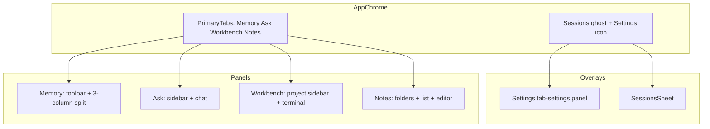
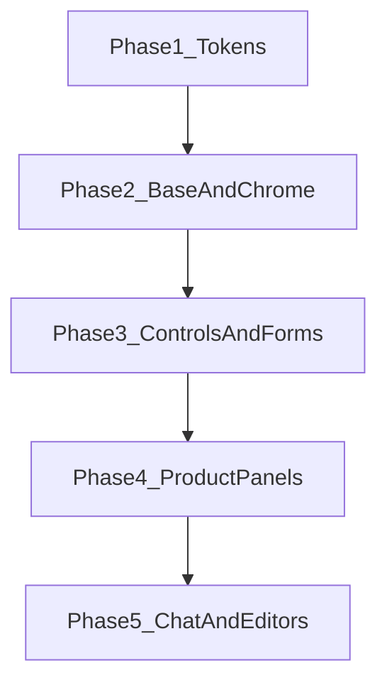

# macOS Desktop Design System

> **Scope:** Electron desktop renderer only (`apps/desktop/src/renderer/`).  
> **Authority:** This document is the single source of truth for visual design. All desktop UI work must conform to it.  
> **Reference:** [Apple macOS Human Interface Guidelines](https://developer.apple.com/design/human-interface-guidelines/designing-for-macos)

Agent execution rules live in [`ui-policy.md`](ui-policy.md). This file defines **what** the UI should look like and **how** to migrate [`styles.css`](../../apps/desktop/src/renderer/styles.css).

---

## 1. Design Principles

### 1.1 HIG Pillars (macOS)

| Principle | Meaning in this app |
| --- | --- |
| **Clarity** | Hierarchy via label color tiers, weight, and spacing — not heavy borders or decoration. |
| **Deference** | Content (chat, notes, calendar, terminal) owns the window; chrome stays light. |
| **Depth** | Use sidebars, sheets, selection fills, and subtle shadows to express layering — not modal stacks. |

### 1.2 Desktop-first Rules

- Design for pointer + keyboard on a resizable window (860–1120+ px wide).
- Reuse existing information architecture: top primary tabs, per-panel toolbars, right sheets for Settings/Sessions.
- **Do not** import iOS/mobile patterns: bottom tab bars, full-screen card flows, FABs, 44pt touch targets, swipe-only navigation.

### 1.3 Framework Constraint

The renderer stays framework-free (`index.html` + `app.js` + `styles.css`). Visual consistency is achieved through **shared CSS tokens and component classes**, not a UI library.

---

## 2. Design Tokens

Tokens are the refactor foundation. Phase 1 introduces semantic tokens; legacy aliases bridge existing rules until each component is migrated.

### 2.1 Color — Semantic Layer

Use macOS-aligned semantic names. Values approximate system colors in CSS (Electron cannot call `NSColor` directly).

#### Light appearance

```css
:root {
  color-scheme: light dark;

  /* Surfaces */
  --color-window-bg: #f5f5f7;
  --color-control-bg: #ffffff;
  --color-secondary-bg: #ebebf0;
  --color-tertiary-bg: #e5e5ea;
  --color-elevated-bg: #ffffff;

  /* Separators & borders */
  --color-separator: rgba(60, 60, 67, 0.12);
  --color-separator-opaque: #d1d1d6;

  /* Labels (text) */
  --color-label-primary: rgba(0, 0, 0, 0.85);
  --color-label-secondary: rgba(0, 0, 0, 0.55);
  --color-label-tertiary: rgba(0, 0, 0, 0.25);
  --color-label-quaternary: rgba(0, 0, 0, 0.16);

  /* System accents */
  --color-accent: #007aff;
  --color-accent-hover: #0066d6;
  --color-destructive: #ff3b30;
  --color-success: #34c759;
  --color-warning: #ff9500;

  /* Interactive fills */
  --color-fill-primary: rgba(0, 122, 255, 0.14);
  --color-fill-secondary: rgba(0, 0, 0, 0.06);
  --color-fill-tertiary: rgba(0, 0, 0, 0.04);

  /* Focus */
  --color-focus-ring: rgba(0, 122, 255, 0.45);
}
```

#### Dark appearance

```css
@media (prefers-color-scheme: dark) {
  :root {
    --color-window-bg: #1e1e1e;
    --color-control-bg: #2c2c2e;
    --color-secondary-bg: #3a3a3c;
    --color-tertiary-bg: #48484a;
    --color-elevated-bg: #2c2c2e;

    --color-separator: rgba(84, 84, 88, 0.65);
    --color-separator-opaque: #545456;

    --color-label-primary: rgba(255, 255, 255, 0.85);
    --color-label-secondary: rgba(255, 255, 255, 0.55);
    --color-label-tertiary: rgba(255, 255, 255, 0.25);
    --color-label-quaternary: rgba(255, 255, 255, 0.16);

    --color-accent: #0a84ff;
    --color-accent-hover: #409cff;
    --color-destructive: #ff453a;
    --color-success: #30d158;
    --color-warning: #ff9f0a;

    --color-fill-primary: rgba(10, 132, 255, 0.18);
    --color-fill-secondary: rgba(255, 255, 255, 0.08);
    --color-fill-tertiary: rgba(255, 255, 255, 0.05);

    --color-focus-ring: rgba(10, 132, 255, 0.55);
  }
}
```

#### Legacy alias map (Phase 1 transition)

| Legacy token | Semantic replacement | Notes |
| --- | --- | --- |
| `--bg` | `--color-window-bg` | Window / main background |
| `--panel` | `--color-control-bg` | Cards, toolbars, inputs |
| `--border` | `--color-separator-opaque` | 1px rules; prefer `--color-separator` where opacity works |
| `--text` | `--color-label-primary` | Body and titles |
| `--muted` | `--color-label-secondary` | Captions, meta, table headers |
| `--accent` | `--color-accent` | Links, selection, primary actions |
| `--danger` | `--color-destructive` | Errors, delete emphasis |
| `--ok` | `--color-success` | Success states |
| `--agent-chat` | `--color-accent` | Chat chrome accent only |

Keep `--agent-codex`, `--agent-claude`, `--agent-agy`, `--agent-grok`, `--agent-alma`, `--agent-opencode`, `--agent-pi` unchanged — they identify providers, not system chrome.

#### Chat token migration (`--tg-*` → `--chat-*`)

Replace Telegram-style tokens in Phase 5:

| Legacy `--tg-*` | New `--chat-*` | Light target | Dark target |
| --- | --- | --- | --- |
| `--tg-chat-bg` | `--chat-bg` | `--color-window-bg` | `--color-window-bg` |
| `--tg-compose-bg` | `--chat-compose-bg` | `--color-control-bg` | `--color-control-bg` |
| `--tg-compose-field` | `--chat-compose-field` | `--color-secondary-bg` | `--color-tertiary-bg` |
| `--tg-bubble-out` | `--chat-bubble-user` | `--color-accent` at 12% mix on control bg | `--color-fill-primary` |
| `--tg-bubble-in` | `--chat-bubble-assistant` | `--color-control-bg` | `--color-control-bg` |
| `--tg-bubble-out-text` | `--chat-bubble-user-text` | `--color-label-primary` | `--color-label-primary` |
| `--tg-bubble-in-text` | `--chat-bubble-assistant-text` | `--color-label-primary` | `--color-label-primary` |
| `--tg-sender` | `--chat-meta` | `--color-accent` | `--color-accent` |
| `--tg-send-btn` | `--chat-send` | `--color-accent` | `--color-accent` |

**Chat visual target:** flat message rows on window background — user messages right-aligned with light accent fill; assistant messages left-aligned on control background; **no** green Telegram bubbles, **no** heavy bubble shadows, **no** chat wallpaper gradients.

### 2.2 Typography

```css
:root {
  --font-family-system: -apple-system, BlinkMacSystemFont, "SF Pro Text", "Helvetica Neue", sans-serif;
  --font-family-mono: ui-monospace, "SF Mono", Menlo, Consolas, monospace;

  --font-size-title: 15px;
  --font-size-headline: 13px;
  --font-size-body: 13px;
  --font-size-callout: 12px;
  --font-size-caption: 11px;
  --font-size-micro: 10px;

  --font-weight-regular: 400;
  --font-weight-medium: 500;
  --font-weight-semibold: 600;

  --line-height-tight: 1.25;
  --line-height-body: 1.45;
  --line-height-relaxed: 1.55;
}
```

| Style | Token stack | Use |
| --- | --- | --- |
| Title 3 | 15px / 600 / 1.25 | `.quiet-title`, sheet headings, panel titles |
| Headline | 13px / 600 / 1.3 | Row titles, card headers, nav active |
| Body | 13px / 400 / 1.45 | Buttons, lists, forms, chat |
| Callout | 12px / 400 / 1.4 | Search fields, inline labels |
| Caption | 11px / 400 / 1.35 | `.muted`, meta, table provider column |
| Monospace | 12px / 400 / 1.5 | `.markdown-body code`, terminal, paths |

Rules:

- Use **system font stack only**; no web fonts.
- `letter-spacing` only for uppercase micro labels (e.g. `td.provider`); default `normal` elsewhere.
- Apply `-webkit-font-smoothing: antialiased` on `body`.

### 2.3 Spacing (8pt Grid)

```css
:root {
  --space-1: 4px;
  --space-2: 8px;
  --space-3: 12px;
  --space-4: 16px;
  --space-5: 20px;
  --space-6: 24px;
  --space-7: 32px;
}
```

| Context | Spacing |
| --- | --- |
| Chrome padding | `10px 16px` (`.mac-top`), left `78px` for traffic lights |
| Main content inset | `10px 16px 12px` (`main`) |
| Toolbar gaps | `8px` within groups, `12px` between groups |
| List row padding | `6px 10px` horizontal, `4–6px` vertical |
| Form field gap | `12px` between fields (`gap` in `.form`) |
| Sheet panel padding | `16px 20px` body, `12px 16px` head |

### 2.4 Corner Radius

```css
:root {
  --radius-sm: 4px;   /* chips, code blocks, small tags */
  --radius-md: 6px;   /* buttons, inputs, segmented inner thumb */
  --radius-lg: 8px;   /* cards, popovers, list hover rows */
  --radius-xl: 10px;  /* sheet panels, large cards */
  --radius-full: 999px; /* icon button hover pills */
}
```

**Current drift to fix:** 10px/12px/14px radii (`ask-chat-shell` 14px, `digest-card` 12px) consolidate to `--radius-lg` / `--radius-xl`.

### 2.5 Shadow & Elevation

Use sparingly — macOS prefers separators over shadow.

```css
:root {
  --shadow-popover: 0 4px 16px rgba(0, 0, 0, 0.12), 0 0 0 0.5px var(--color-separator);
  --shadow-segment-thumb: 0 1px 2px rgba(0, 0, 0, 0.09), 0 0 0 0.5px var(--color-separator);
}
```

Allowed on: `.ops-menu`, `.sidebar-project-filter-thumb`, `.sheet-panel` (optional).  
**Not allowed on:** list rows, split panes, toolbars, calendar cells.

### 2.6 Motion

```css
:root {
  --duration-fast: 150ms;
  --duration-normal: 220ms;
  --ease-out: cubic-bezier(0.33, 1, 0.68, 1);
}
```

| Interaction | Duration | Easing |
| --- | --- | --- |
| Hover/fill | 150ms | ease-out |
| Segmented thumb slide | 220ms | `--ease-out` |
| Sheet enter | 220ms | ease-out (translate X, no bounce) |
| Progress bar width | 220ms | ease-out |

Always provide `@media (prefers-reduced-motion: reduce)` overrides (disable transforms/transitions). Reference: existing `.sidebar-project-filter-thumb` pattern.

### 2.7 Z-Index Scale

| Layer | Value | Examples |
| --- | --- | --- |
| Base | 0 | Panels, lists |
| Sticky header | 1 | `.digest-card-head`, `th` |
| Popover | 40 | `.ops-menu` |
| Sheet | 50 | `.sheet` |
| Overlay editor | 60 | `.gtd-md-overlay` |

---

## 3. Base Layer

Target CSS file organization after refactor:

1. **Tokens** — `:root` + `prefers-color-scheme` + legacy aliases
2. **Reset** — `box-sizing`, `color-scheme`, font smoothing, `html/body` flex column shell
3. **Focus** — global `:focus-visible` (see §6)
4. **Primitives** — `.btn` base, `.separator`, `.muted` (caption style)
5. **Components** — chrome, controls, lists, panels
6. **Panel overrides** — memory, ask, notes, workbench, settings

### 3.1 Button Reset (critical refactor)

**Remove** the global rule that styles all buttons:

```css
/* DELETE during refactor */
.tab,
button {
  appearance: none;
  border: 1px solid var(--border);
  /* ... */
}
```

**Replace** with explicit classes:

| Class | Role |
| --- | --- |
| `.btn` | Base: `appearance: none`, `font-family`, `cursor`, `border-radius: var(--radius-md)` |
| `.btn-default` | Control background + separator border |
| `.btn-ghost` | Transparent; maps to `.ghost-btn` |
| `.btn-tool` | Maps to `.tool-btn` |
| `.btn-icon` | Maps to `.icon-btn` / `.notes-icon-btn` |
| `.tab` | Primary navigation tab (extends `.btn-ghost` or underline variant) |

Existing class names (`.ghost-btn`, `.tool-btn`, etc.) may be kept as aliases during migration.

### 3.2 Separators

Prefer `border-color: var(--color-separator)` or `1px solid var(--color-separator-opaque)` over thick boxes. Split views use a single vertical separator between panes (`.report-layout`, `.agent-layout`, `.notes-layout`).

### 3.3 Hit Targets

- Minimum interactive size: **24×24px** (macOS compact); icon buttons target **28×28px**.
- Do not inflate to 44px mobile sizes.

---

## 4. Component Specifications

Each component lists: **anatomy**, **tokens**, **states**, and **existing classes**.

### 4.1 App Chrome

**Classes:** `.top`, `.mac-top`, `.primary-tabs`, `.top-actions`, `.quiet-title`

| Property | Spec |
| --- | --- |
| Height | ~40px total |
| Background | `--color-control-bg` |
| Bottom edge | `1px solid var(--color-separator)` |
| Left padding | `78px` (traffic light safe area) |
| Drag | `-webkit-app-region: drag` on `.mac-top` |
| No-drag | All `button`, `select`, inputs: `no-drag` |

**Primary tabs (`.tab`):**

| State | Background | Text | Border / indicator |
| --- | --- | --- | --- |
| Default | transparent | `--color-label-secondary` | none |
| Hover | `--color-fill-tertiary` | `--color-label-primary` | none |
| Active | transparent or light fill | `--color-accent` | 2px bottom border `--color-accent` **or** pill fill |
| Focus-visible | — | — | `--color-focus-ring` outline |

**Top actions:** `.ghost-btn` for Sessions; `.icon-btn` for Settings gear. Align vertically center with tabs.

### 4.2 Toolbar

**Classes:** `.toolbar`, `.report-toolbar`, `.ask-toolbar`, `.row`, `.cal-nav-left`, `.cal-nav-right`

- Single horizontal row; `space-between` when two groups.
- Height ~32–36px; margin-bottom `--space-3`.
- Secondary actions use `.ghost-btn`; navigation/steppers use `.tool-btn`.

### 4.3 Buttons

#### Tool button (`.tool-btn`)

| State | Background | Border | Text |
| --- | --- | --- | --- |
| Default | `--color-control-bg` | `1px solid var(--color-separator-opaque)` | `--color-label-primary` |
| Hover | `--color-fill-tertiary` | separator | `--color-label-primary` |
| Active | `--color-fill-secondary` | accent 30% mix | `--color-accent` |
| Disabled | control bg 50% opacity | separator | `--color-label-tertiary` |
| Focus-visible | — | — | ring |

Padding: `5px 10px`; font: `--font-size-body`.

#### Ghost button (`.ghost-btn`)

| State | Background | Text |
| --- | --- | --- |
| Default | transparent | `--color-accent` |
| Hover | `--color-fill-primary` | `--color-accent` |
| Active | `--color-fill-primary` stronger | `--color-accent-hover` |

No border in default state. `.ask-toolbar .ghost-btn.active` uses accent border — keep for toggle tools (Audit).

#### Icon button (`.icon-btn`, `.notes-icon-btn`)

- Size: 28×28px touch area, SVG 17×17px (notes) or 16px (gear).
- Border: none; background transparent.
- Hover: circular `--color-fill-tertiary` fill, `--radius-full`.
- Destructive variant (`.notes-toolbar-delete`): hover uses `--color-destructive` at 14% fill.

### 4.4 Segmented Control (reference implementation)

**Classes:** `.sidebar-project-filter-segmented`, `.sidebar-project-filter-thumb`, `.notes-segmented`, `.notes-target-tabs`

This is the **gold standard** macOS control in the codebase. All multi-option toggles should match:

- Outer: `1px` separator border, `--radius-lg`, `--color-secondary-bg` track
- Thumb: `--color-control-bg`, `--shadow-segment-thumb`, `--radius-md`, slides with `--duration-normal`
- Segments: caption font 11px; inactive `--color-label-secondary`; active `--color-label-primary` weight 500
- `role="tablist"` / `role="tab"` where applicable (already in Notes)

Migrate `.notes-target-tabs` and `.notes-segmented` to use thumb pattern if they do not already.

### 4.5 Popover Menu

**Classes:** `.ops-wrap`, `.ops-menu`

| Property | Value |
| --- | --- |
| Min width | 200px |
| Padding | 6px |
| Radius | `--radius-lg` |
| Shadow | `--shadow-popover` |
| Background | `--color-elevated-bg` |
| Item padding | `8px 10px` |
| Item hover | `--color-fill-secondary` |
| Item radius | `--radius-md` |

### 4.6 Sheet (Right Panel)

**Classes:** `.sheet`, `.sheet-backdrop`, `.sheet-panel`, `.sheet-wide`, `.sheet-head`, `.sheet-body`

| Property | Value |
| --- | --- |
| Width | `min(440px, 100%)` (wide variant: existing `.sheet-wide` rules) |
| Backdrop | `rgba(0, 0, 0, 0.28)` |
| Panel bg | `--color-control-bg` |
| Left edge | `1px solid var(--color-separator)` |
| Animation | translateX from off-screen, 220ms ease-out |
| Head | Title 15px semibold; close/actions right-aligned |

Used for: Sessions (`#sheetSessions`), GTD (`#sheetGtd`). Settings uses a full-panel swap (`#tab-settings`), not a sheet. **Do not** replace with centered dialogs.

### 4.7 Search Field

**Classes:** `.sidebar-project-search`, `.notes-search`, `.notes-target-search`, `.notes-find-input`

| Property | Value |
| --- | --- |
| Background | `--color-secondary-bg` |
| Border | none (macOS search field style) |
| Radius | `--radius-md` |
| Padding | `6px 9px` |
| Font | `--font-size-callout` |
| Focus | `outline: 2px solid var(--color-focus-ring)` |

### 4.8 Form Controls

**Classes:** `.form`, `label`, `input`, `select`, `textarea`, `fieldset`, `.inline-label`, `.form-row`, `.gtd-edit-grid`

| Element | Spec |
| --- | --- |
| Label | Caption size, `--color-label-secondary`, `gap: 4px` above control |
| Input/select/textarea | `--color-control-bg` background, `1px solid var(--color-separator-opaque)`, `--radius-md`, padding `8px 10px` |
| Focus | focus ring, not border color alone |
| Fieldset | `--radius-xl`, padding `--space-3`, separator border |
| Disabled | `--color-label-tertiary` text, reduced opacity |

Settings forms max-width: 640px (`.settings-form`).

### 4.9 List Row

**Classes:** `.session-row`, `.cal-session-row`, `.agent-sidebar-list` items, `.notes-list` items, `.settings-nav-item`

| State | Background | Text |
| --- | --- | --- |
| Default | transparent | `--color-label-primary` |
| Hover | `--color-fill-tertiary` | primary |
| Selected | `--color-fill-primary` | primary, semibold |
| Disabled | transparent | `--color-label-tertiary` |

- Row height: 28–32px effective.
- No per-row border; optional `1px` separator between groups only.
- Provider tags (`.s-provider-tag`): caption, uppercase, `--color-label-tertiary`.

### 4.10 Split View & Resizer

**Classes:** `.report-layout`, `.agent-layout`, `.notes-layout`, `.workbench-layout`, `.sessions-split`, `.pane-resizer`

| Pane | Width guidance |
| --- | --- |
| Memory calendar | `min(340px, 30vw)`, max 360px |
| Memory sessions | `min(260px, 26vw)`, max 280px |
| Ask/Notes sidebar | collapsible `.sidebar-folders-pane`, resizable |
| Notes list | resizable via `.pane-resizer` |

- Divide with `1px solid var(--color-separator)`.
- Resizer: `role="separator"`, keyboard accessible, hover shows `--color-accent` 2px guide.
- Collapsed sidebars: `.is-collapsed` — width 0 or icon strip only.

### 4.11 Table

**Classes:** `.table-wrap`, `.table-wrap.compact`, `table`, `th`, `td`

- Outer: optional `1px` separator, `--radius-lg`.
- Header: sticky, `--color-label-secondary`, semibold, `--color-control-bg`.
- Rows: `1px` bottom separator only.
- Time column: tabular nums, secondary label color.

### 4.12 Card

**Classes:** `.digest-card`, `.usage-card`, `.digest-stale-banner`

| Property | Value |
| --- | --- |
| Radius | `--radius-xl` |
| Background | `--color-control-bg` |
| Head | sticky optional; separator below head |
| Body padding | `12px 14px` |

Warning banner (`.digest-stale-banner`): use `--color-warning` at 10% background mix, not hard-coded orange `#f97316`.

### 4.13 Calendar (Memory)

**Classes:** `.cal-grid`, `.cal-cell`, `.cal-weekdays`, `.cal-week-btn`, `.dot`, `.cal-legend`

- Cells: square-ish, min touch 24px; selected ring `2px solid var(--color-accent)`.
- Today: accent dot or subtle fill — combine with selected state clearly.
- Status dots (`.dot.daily`, `.weekly`, etc.): keep semantic colors; size 6–8px.
- Week column header: caption style.

### 4.14 Progress & Status

**Classes:** `.status`, `.gen-progress`, `.gen-progress-bar`, `.agent-index-progress`, `.agent-index-progress-bar`

- Status line: caption, `--color-label-secondary`; errors `--color-destructive`; success `--color-success`.
- Progress track: `--color-secondary-bg`, height 4–6px, radius full.
- Progress fill: `--color-accent`; error state `--color-destructive`.
- Scanning pulse: subtle, respect reduced motion.

### 4.15 Markdown Content

**Classes:** `.markdown-body`, `.cal-detail`, `.digest-body`

- Headings: primary label color; `h1`/`h2` bottom separator only.
- Links: `--color-accent`, underline on hover.
- Code inline: `--color-fill-secondary` background, `--radius-sm`.
- Code blocks: mono font; keep vendor highlight.js themes for syntax only.
- Blockquote: left accent bar 3px, secondary label text.

### 4.16 Chat (Ask Panel)

**Classes:** `.ask-chat-shell`, `.chat-log`, `.chat-message`, `.chat-bubble`, `.chat-compose`, `.chat-compose-field`, `.chat-send-btn`, `.chat-tools-toggle`

**Target macOS Messages / ChatGPT desktop aesthetic** (not Telegram):

| Region | Spec |
| --- | --- |
| Shell | `--radius-xl`, `1px` separator border, **no** gradient wallpaper |
| Log background | `--chat-bg` (= window bg) |
| User bubble | Right aligned; max 78% width; `--chat-bubble-user` subtle fill; radius asymmetric optional but **subtle** |
| Assistant bubble | Left aligned; control bg; no heavy shadow |
| Compose bar | `--chat-compose-bg`; field `--chat-compose-field`; top separator |
| Send button | 32px circle, `--chat-send` fill, white icon; disabled at 40% opacity |
| Tools toggle | Icon button; `aria-pressed`; active uses `--color-fill-primary` |

Remove: `box-shadow` on bubbles, radial-gradient on `.chat-log`.

### 4.17 Settings

**Classes:** `.settings-layout`, `.settings-nav`, `.settings-nav-item`, `.settings-main`, `.settings-form`, `.settings-save-bar`, `.usage-cards`

- Mirror macOS Settings: left nav 180px, right scrollable form.
- Nav item active: `--color-fill-primary` + semibold (already close; align tokens).
- Save bar: pin bottom of sheet body; separator top.
- Usage cards: grid of `.usage-card` with `--radius-lg`.

### 4.18 Workbench & Terminal

**Classes:** `.workbench-layout`, `.wb-detail`, `.wb-terminal-shell`, `.wb-terminal-tabs`, `.wb-terminal-tab`

- Terminal: preserve `xterm.css` / vendor colors inside terminal surface only.
- Outer chrome: window bg + separator borders.
- Tab bar: compact pills similar to `.wb-terminal-tab`; close affordance on hover.
- Remove project label: caption secondary (`.wb-detail-project-label`).

### 4.19 Notes Editor

**Classes:** `.notes-detail`, `.notes-editor-shell`, `.notes-detail-head`, `.notes-segmented`, `.notes-find-bar`, CodeMirror wrappers

- Title: `.notes-detail-title` uses Title 3.
- Edit/View segmented control: same thumb pattern as §4.4.
- Find bar: secondary bg strip below title; icon buttons 24px.
- Editor surface: `--color-control-bg`; focus within editor does not change outer chrome.

### 4.20 GTD & Overlays

**Classes:** `.gtd-row`, `.gtd-md-overlay`, `.digest-panel`

- Disclosure rows: chevron + headline; hover fill on head only.
- Markdown overlay: full-area over sheet body, z-index 60; backdrop click dismisses.
- Prefer sheet context over new window.

---

## 5. Layout & Window

### 5.1 Window Configuration

Defined in [`main.ts`](../../apps/desktop/src/main/main.ts) — **do not change** without explicit product request:

| Property | Value |
| --- | --- |
| Default size | 1120 × 780 |
| Minimum size | 860 × 600 |
| Title bar (darwin) | `hiddenInset` |
| Traffic lights | `{ x: 14, y: 14 }` |

### 5.2 Information Architecture



### 5.3 Panel Layout Summary

| Panel | DOM root | Layout pattern |
| --- | --- | --- |
| Memory | `#tab-report` | Toolbar + `.report-layout` 3-pane |
| Ask | `#tab-agent` | `.agent-layout` sidebar + main |
| Workbench | `#tab-workbench` | `.workbench-layout` sidebar + terminal |
| Notes | `#tab-notes` | `.notes-layout` 3-pane + resizers |
| Settings | `#tab-settings` | `.settings-layout` nav + form (replaces main tabs when open) |
| Sessions | `#sheetSessions` | `.sessions-split` list + preview |

### 5.4 Responsive Rules

At **860px** minimum width:

- Sidebars may collapse via `.sidebar-collapse-toggle`.
- Toolbars wrap (`flex-wrap: wrap`); do not horizontal-scroll the whole window.
- Sheets remain full-height right column; min width 320px usable.
- Memory calendar pane shrinks to `min(340px, 30vw)` — never below 240px without collapse.

---

## 6. Accessibility

| Requirement | Implementation |
| --- | --- |
| Icon-only buttons | `aria-label` + `title` (mandatory) |
| Collapse toggles | `aria-expanded` |
| Segmented controls | `role="tablist"` / `role="tab"` + `aria-selected` |
| Resizers | `role="separator"`, `aria-orientation`, keyboard resize |
| Focus visible | `:focus-visible { outline: 2px solid var(--color-focus-ring); outline-offset: 2px; }` on all interactive elements |
| Contrast | Primary label vs background ≥ 4.5:1 (WCAG AA) |
| Reduced motion | Disable thumb slide, pulse, sheet slide when `prefers-reduced-motion: reduce` |
| Chat tools | `aria-pressed` on toggle |

Do not rely on color alone for state (add weight, icon, or label).

---

## 7. Migration Plan

Refactor [`styles.css`](../../apps/desktop/src/renderer/styles.css) (~4673 lines, ~678 class selectors) in five phases. Each phase is independently shippable.



### Phase 1 — Tokens

**Scope:** `:root` semantic tokens + legacy aliases.

```css
/* Example bridge */
--bg: var(--color-window-bg);
--panel: var(--color-control-bg);
--border: var(--color-separator-opaque);
--text: var(--color-label-primary);
--muted: var(--color-label-secondary);
--accent: var(--color-accent);
```

**Exit criteria:** Light/Dark window background and text correct app-wide without editing individual rules yet.

### Phase 2 — Base & Chrome

**Scope:**

- Global button reset refactor (§3.1)
- `.mac-top`, `.tab`, `.primary-tabs`, `.top-actions`
- `.sheet`, `.ops-menu`
- `body` font smoothing + focus-visible base

**Exit criteria:** Traffic lights unobstructed; drag/no-drag works; tabs and sheets match component spec.

### Phase 3 — Controls & Forms

**Scope:**

- `.tool-btn`, `.ghost-btn`, `.icon-btn`, `.notes-icon-btn`
- `.sidebar-project-filter-segmented` (align tokens only)
- `input`, `select`, `textarea`, `label`, `fieldset`, `.table-wrap`
- `.pane-resizer`, `.sidebar-collapse-toggle`

**Exit criteria:** All control states consistent; keyboard focus visible everywhere.

### Phase 4 — Product Panels

**Scope:**

- Memory: `.report-layout`, calendar, `.cal-session-*`, `.digest-card`, `.gen-progress`
- Sessions sheet: `.sessions-split`, `.session-row`, `.session-preview-*`
- Settings: `.settings-*`, `.usage-card`
- Workbench chrome: `.wb-*` except terminal internals

**Exit criteria:** Three-column Memory layout stable at 860px and 1120px; Settings nav matches spec.

### Phase 5 — Chat & Editors

**Scope:**

- Introduce `--chat-*` tokens; remove `--tg-*` usage
- `.ask-*`, `.chat-*` visual redesign
- Notes: `.notes-*`, editor, find bar, target popover
- `.markdown-body` color pass
- Remove hard-coded colors (e.g. `#f97316`, `#e05252` in workbench delete hover) → semantic tokens

**Exit criteria:** Ask panel has no Telegram green bubbles; no `--tg-*` references remain.

### What NOT to change

- `apps/desktop/src/renderer/vendor/**` (CodeMirror, xterm, highlight.js CSS)
- IPC / preload contracts
- `index.html` structure (unless renaming classes in tandem with CSS)
- Window dimensions in `main.ts`
- Agent brand colors (`--agent-*`)

### Alias removal

After Phase 5, delete legacy `--bg`, `--panel`, etc. aliases in a final cleanup PR once grep shows zero direct dependency on old names.

---

## 8. Verification Checklist

Run after **each** migration phase:

| Check | Command / action |
| --- | --- |
| Build | `npm run build:desktop` |
| macOS visual | `npm run dev:mac -w @agent-resume/desktop` |
| Width 860px | No horizontal overflow; sidebars collapse or shrink |
| Width 1120px | Default layout proportions |
| Light appearance | System light mode or `prefers-color-scheme: light` |
| Dark appearance | System dark mode |
| Chrome | Drag title bar; click tabs; traffic lights visible |
| Keyboard | Tab through new/changed controls; focus ring visible |
| Reduced motion | Enable macOS Reduce motion; segmented thumb and sheet animations disabled |

---

## Appendix A — Class Inventory by Panel

Quick reference for refactor scope (non-exhaustive; see `styles.css` for full list).

| Panel | Key selectors |
| --- | --- |
| Global | `.top`, `.mac-top`, `.tab`, `.panel`, `.toolbar`, `.sheet*`, `.muted`, `.status` |
| Memory | `.memory-*`, `.cal-*`, `.digest-*`, `.gen-progress*` |
| Ask | `.ask-*`, `.chat-*`, `.sidebar-folders-*` |
| Notes | `.notes-*`, `.sidebar-project-*`, `.pane-resizer` |
| Workbench | `.workbench-*`, `.wb-*` |
| Settings | `.settings-*`, `.usage-*`, `.form-row` |
| Sessions | `.sessions-*`, `.session-*`, `.preview-*` |
| GTD | `.gtd-*` |

## Appendix B — Related Files

| File | Role |
| --- | --- |
| [`styles.css`](../../apps/desktop/src/renderer/styles.css) | All component styles to migrate |
| [`index.html`](../../apps/desktop/src/renderer/index.html) | Shell markup and class hooks |
| [`app.js`](../../apps/desktop/src/renderer/app.js) | Dynamic class toggles (`active`, `hidden`, `is-collapsed`) |
| [`main.ts`](../../apps/desktop/src/main/main.ts) | Window chrome configuration |
| [`ui-policy.md`](ui-policy.md) | Agent behavioral rules |
| [`desktop.md`](../menus/desktop.md) | Feature code map |