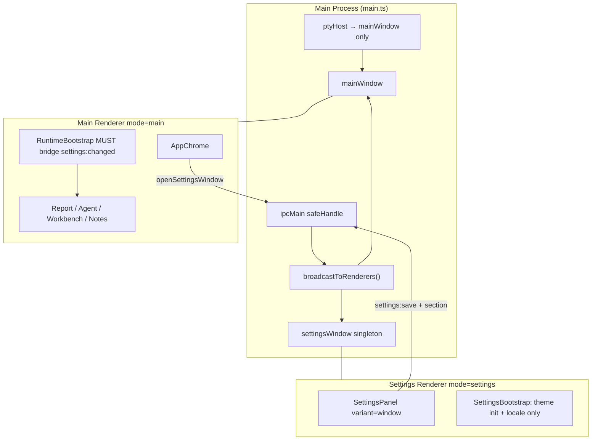
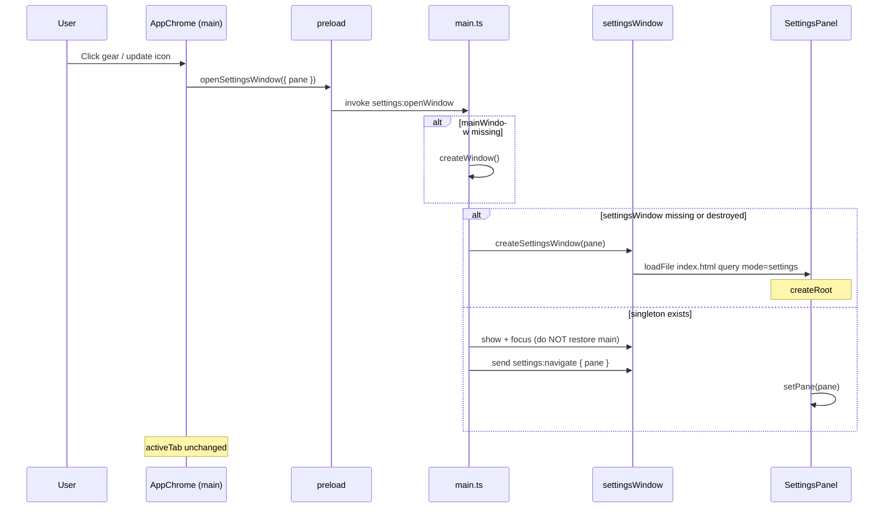
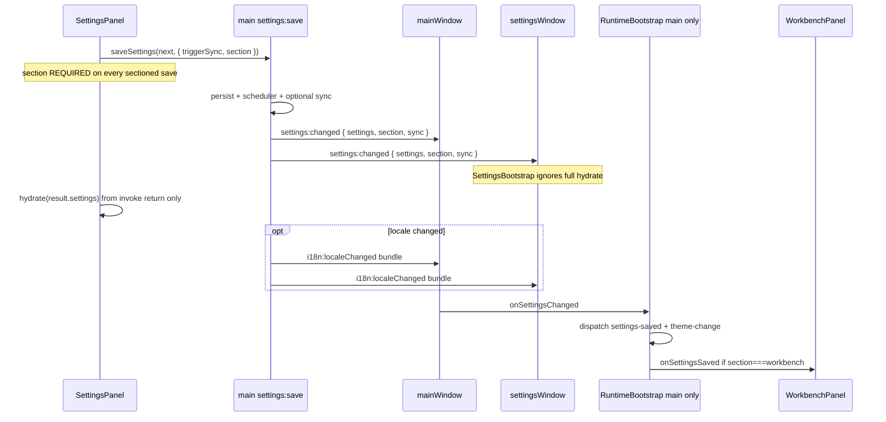
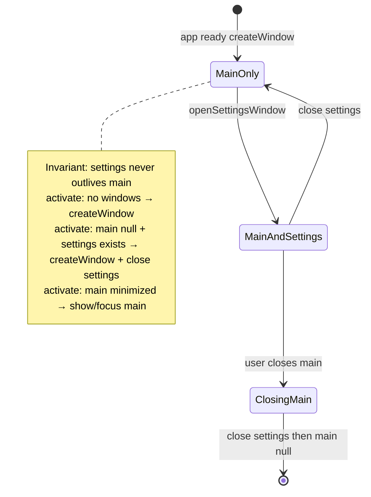

# Desktop Settings 辅助窗口（Scheme A）

| 字段 | 值 |
| --- | --- |
| **Title** | Desktop Settings Auxiliary Window (Scheme A) |
| **Author** | Product / TBD implementer |
| **Date** | 2026-07-21 |
| **Status** | Draft（rev 2 — review addressed） |
| **Scope** | `apps/desktop` only（Electron 35） |
| **Out of product scope** | Extension / VS Code settings；全量多主窗口 `⌘N`；Scheme C in-window sheet |

---

## Overview

当前 Agent Resume Desktop 将 Settings 当作主窗口内的全屏面板：`AppChrome.openSettings` 把 `activeTab` 切到 `"settings"`，`SettingsPanel` 通过 portal 挂到 `#react-settings`，关闭时又强制回到 Report。这会 **隐藏**（非销毁）当前主内容区；Workbench 内嵌 **PTY 进程通常仍存活**，但用户失去可见终端上下文，且关闭设置硬跳 Report，进行中的工作流被打断。

本设计采用已确认的产品方案 **Scheme A**：Settings 在 **全局单例辅助 `BrowserWindow`** 中打开（macOS Preferences 风格）。主窗口 **不切换 tab**，继续显示 Report / Agent / Workbench / Notes。保存主题、语言与其它配置后，经 **main 进程 IPC 广播** 同步到所有相关窗口，替代原先同文档 `CustomEvent` 的隐式耦合。

**合并策略（硬约束）：** main 窗体 IPC 与 renderer `mode=settings` 分支 **不得作为可发布中间态分别合入主干**——见 [PR Plan](#pr-plan) 与 [Merge policy](#merge-policy-pr1pr2)。在 `mode=settings` 生效前，若错误地加载完整 React 树，第二窗口会挂载 `WorkbenchPanel`；而 `registerPtyIpc(() => mainWindow)` **不按 `event.sender` 拒绝** `terminal:spawn` / `terminal:input`，仅把 **输出** 推到 main——可导致 PTY I/O 错窗。生产路径 **禁止** 「完整 preload + 完整主 UI」作为 Settings 窗中间态。

---

## Background & Motivation

### 当前打开路径（同文档、同窗口）

| 步骤 | 代码位置 | 行为 |
| --- | --- | --- |
| 齿轮 / 更新图标 | `apps/desktop/src/renderer-react/components/AppChrome.tsx` → `openSettings(pane)` | `setActiveTab("settings")` + `agent-resume:tab-change` + `agent-resume:settings-open` |
| 面板显示 | `apps/desktop/src/renderer-react/features/settings/SettingsPanel.tsx` | 监听 `settings-open` 设 `open=true`；`tab-change !== "settings"` 时关闭 |
| Done | `SettingsPanel` close | 派发 `agent-resume:settings-closed` → AppChrome 强制 `report` |
| DOM | `apps/desktop/src/renderer/index.html` | `#react-settings` 全面板 portal，非 sheet / 非第二 OS 窗口 |
| 样式现状 | `styles.css` | `#react-settings { display: contents; }`；panel 参与 `main` flex；`main` 有 padding；traffic-light  inset 仅在 `.mac-top`（`padding-left: 78px`），Settings toolbar **不是** `.mac-top` |

### 主进程单窗口假设

`apps/desktop/src/main/main.ts`：

- 全局 `mainWindow: BrowserWindow | null`；仅 `createWindow()`。
- 推送目标几乎只指向 `mainWindow`：`sessions:synced` / `sessions:syncFailed`、`notes:indexProgress`、`i18n:localeChanged`。
- `registerPtyIpc(() => mainWindow)`：PTY **输出** 固定发往 main；**spawn/input 未校验 sender**（双全量 UI 时的隐患）。
- Workbench `⌘T` / `⌘W` 只挂在 main 的 `webContents`；`workbench:setActive` 仅接受 main 发送者。
- **无** Electron `Menu` / 应用菜单；无 `⌘N`；无多窗口支持。
- `activate`：`getAllWindows().length === 0` 时重建 main。
- `window-all-closed`：停 scheduler / notes indexer / pty；非 darwin 则 `quit`。

### 同文档 CustomEvent 耦合（拆窗后失效）

| Event | 生产者 | 消费者 | 拆窗影响 |
| --- | --- | --- | --- |
| `agent-resume:settings-saved` | `SettingsPanel.save`（**仅** CustomEvent 带 `section`） | `WorkbenchPanel`（`detail?.section === "workbench"` 时 `setSettings`） | **主窗口收不到**；且今日 preload `saveSettings` options **无** `section` |
| `agent-resume:theme-change` | `GeneralPane`（乐观更新） | `main.tsx` `RuntimeBootstrap`、`CodeEditor` | **主窗口收不到** |
| `i18n:localeChanged`（IPC） | `settings:save` 仅 `mainWindow.webContents.send` | `I18nProvider` via preload `onLocaleChanged` | 必须改为 **全窗广播** |
| `agent-resume:tab-change` / `settings-open` / `settings-closed` | AppChrome ↔ SettingsPanel | 开关面板 | 主模式 **应删除** 对 settings tab 的依赖 |

**正确性关键路径（acceptance）：**  
今日 `section` 只存在于同文档 CustomEvent。拆窗后若 IPC `settings:changed` 与桥接漏掉 `section`，Workbench 配置变更会 **静默 no-op**。见下文 [Acceptance: section round-trip](#acceptance-section-round-trip-non-negotiable)。

### 产品目标行为（已确认）

1. 齿轮 / 更新图标 → 打开或聚焦 Settings 辅助窗（可带初始 pane）。
2. 主窗口 **不** 切换 tab。
3. 全局至多一个 Settings 窗；再次打开 = focus（并可选导航到目标 pane）。
4. 关闭 Settings **不** 改变主窗口 tab。
5. 可选：应用菜单「Settings…」+ macOS `⌘,`。
6. **不要** 把 `⌘N` 绑到 Settings（预留给未来新主窗口）。

### 痛点总结

- Settings 占用主内容区 → Workbench UI 被 `hidden`（PTY 一般未 kill，但上下文/焦点丢失）。
- 关闭 Settings 硬编码回 Report → 从 Notes/Agent 进入设置后 tab 上下文丢失。
- 跨功能依赖同 document 事件 → 无法安全拆窗。

---

## Goals & Non-Goals

### Goals

- 实现 **单例 Preferences 风格辅助窗** 承载现有 `SettingsPanel` UI（尽量复用 panes / draft / save 逻辑）。
- 主窗口 tab 状态机 **移除 `"settings"`** 视图。
- 建立 **main 中心化广播**，使 settings / theme / locale 变更到达所有存活窗口。
- **端到端传递 `section`**，保证 Workbench（及未来按 section 过滤的消费者）在拆窗后仍正确更新。
- PTY、Workbench 快捷键、session sync 定时器等 **继续绑定主窗口 only**；settings 模式 **永不** 挂载 Workbench/Agent/Report/Notes。
- 明确 macOS 窗口生命周期不变量：**settings 从不久于 main**。
- 保持 `contextIsolation: true`、`nodeIntegration: false`；preload / renderer 契约同步。
- 验证：`pnpm run build:desktop`、`pnpm --filter @agent-resume/desktop run test:renderer` 及相关用例。

### Non-Goals

- 全量多主窗口 / `⌘N` 新建主窗口。
- Scheme C（主窗内 sheet / 模态层）。
- Extension / VS Code 设置 UI 或 `packages/core` 非必要改动。
- 为 Settings 窗单独做 least-privilege preload 子集（v1 复用同一 preload；后续可收紧）。
- 修改 Java 代码（项目规则）。
- 改变 `settings.desktop.json` 磁盘 schema（仅传输层增加 `section`）。
- 打开 Settings 时强制 restore 已 minimized 的 main（见 K14）。

---

## Key Decisions

| # | 决策 | 理由 |
| --- | --- | --- |
| K1 | **独立非模态 `BrowserWindow`**（**不** 设 `parent`，不 modal） | 用户改设置时可同时看 Workbench/Report；符合 macOS Preferences。Open Question「是否 parent」**已关闭**，采用本决策。 |
| K2 | **全局单例** `settingsWindow`；已存在则 `show` + `focus` + `settings:navigate` | 避免多份草稿竞态写同一 `settings.desktop.json`；连点齿轮不得第二窗。 |
| K3 | **同一 `index.html` + query `mode=settings&pane=...`**；`createRoot` 仍在 `#react-chrome` | 复用 CSS / bundle / preload；settings 模式 children 不同，portal 目标 `#react-settings` 不变。 |
| K4 | **主模式不再挂载 `SettingsPanel`**；settings 模式 **只** 挂 Settings + 最小 bootstrap（**禁止** Workbench 等） | 避免第二全量 UI 与 PTY sender 漏洞叠加。 |
| K5 | **`settings:save` 后 main 广播 `settings:changed`（含 `section`）**；**仅 main 窗** RuntimeBootstrap 桥接为 CustomEvent | 单源广播；Workbench 改动最小。 |
| K6 | **主题乐观更新仅限 Settings 窗本地**；主窗以 save 后广播为准 | 主窗 theme 可滞后 **≤ debounce 450ms + save 往返**（通常 &lt; 1s）；QA 以此为 SLA，非 bug。 |
| K7 | **`i18n:localeChanged` 广播到全部窗口** | 两窗 `I18nProvider` 同步；替换仅推 main。 |
| K8 | **不变量：settings 从不久于 main**；main `closed` → 关闭 settings；`activate` 兜底见生命周期 | 防 orphan Preferences / Dock 假死。 |
| K9 | **PTY / workbench 快捷键 / `workbench:setActive` 仅 main** | Settings 上 `⌘W` 关设置窗，不走 workbench。 |
| K10 | **可选应用菜单 Settings…（`⌘,`）**；**不** 绑定 `⌘N` | macOS 惯例；保留 `⌘N` 给未来。 |
| K11 | Settings 默认 **720×560**，min 640×480；darwin `hiddenInset` + traffic lights；**专用 CSS 全出血**（见 CSS checklist） | 偏好窗体量；避免 `display: contents` + main padding 导致非 preferences 布局。 |
| K12 | Desktop-only；**不改** core/extension | 产品边界。 |
| K13 | Settings 窗 **同样** `loadAppIcon()` / 与 main 相同 icon 候选 | 任务栏/Dock 子窗识别一致。 |
| K14 | **打开 Settings 不 restore main**（main 若 minimized 保持 minimized） | 偏好窗独立；用户可专注改设置。Dock `activate` 仍可 show main（见生命周期）。 |
| K15 | **Navigation hardening**：settings（与 main）对 `will-navigate` / 非预期 load 保持默认本地 `loadFile` 模型；不新增 web 导航 | 与现 main 信任模型一致；不单独为 settings 开豁免。 |
| K16 | **Merge policy**：含可加载 settings 窗的代码与 `mode=settings` renderer **同发布单元**（单 PR 或 stacked 且 PR-A 不得单独 merge 到可发布分支） | 消除双全量 UI / PTY 错窗中间态。 |
| K17 | **Echo 规则**：settings 模式 **不** 因 `settings:changed` 整表 hydrate/替换 draft；仅 main 桥接 full settings-saved；settings 靠 save 返回值 hydrate | 防双次 status / 草稿踩踏。 |

---

## Proposed Design

### 架构总览



### 打开 / 聚焦时序



### 保存与跨窗同步时序（含 section）



### Acceptance: `section` round-trip（non-negotiable）

拆窗后 **唯一** 能驱动主窗 Workbench 配置刷新的路径：

1. `SettingsPanel.save(next, section)` 调用  
   `desktopApi().saveSettings(next, { triggerSync: section === "sessions" || section === "storage", section })`。
2. Preload 将 `section` 传入 `settings:save`。
3. `SaveSettingsOptions`（`sessionSettingsSync.ts`）扩展：`section?: string`（desktop-only，不进 core）。
4. main 在成功后：  
   `broadcastToRenderers("settings:changed", { settings: saved, section: options?.section, sync })`。
5. **Main** `RuntimeBootstrap`：  
   `dispatchEvent("agent-resume:settings-saved", { detail: { settings, section, sync } })`。
6. `WorkbenchPanel` 既有过滤 `detail?.section === "workbench"` 继续工作。

**PR 合并门禁：** 无自动化证明上述链路的 PR **不得** merge（见 Test Plan）。

推荐抽取纯函数便于单测：

```ts
// e.g. apps/desktop/src/renderer-react/settingsBroadcast.ts
export function settingsChangedToCustomEvents(detail: {
  settings: PanelSettings;
  section?: string;
  sync?: AgentSessionSyncResult;
}): Array<{ name: string; detail: unknown }> {
  const events: Array<{ name: string; detail: unknown }> = [
    { name: "agent-resume:settings-saved", detail: {
      settings: detail.settings, section: detail.section, sync: detail.sync
    } }
  ];
  const theme = detail.settings?.desktop?.theme;
  if (theme) {
    events.push({ name: "agent-resume:theme-change", detail: theme });
  }
  return events;
}
```

### 双窗 echo 规则（K17 细化）

| 窗口 | 收到 `settings:changed` 后 | save invoke 返回后 |
| --- | --- | --- |
| **Main** | **必须** 桥接 → `settings-saved` + 若有 theme → `theme-change` | N/A（主窗不 save UI） |
| **Settings** | **禁止** 用 payload 做 full draft `hydrate` / 替换未保存编辑中的字段 | **仅** `hydrate(result.settings)`（与今日一致） |
| **Settings** 本地 CustomEvent | **不要** 再派发 `settings-saved`（无本窗消费者）；theme 乐观更新仍可本地 `theme-change` | — |

说明：broadcast 无法像 `event.sender` 那样“忽略自己”；因此用 **模式分流**，而非 version 字段（v1 足够）。未来若有第二写者，再考虑 `sourceWindowId` / 序号。

### 窗口生命周期（macOS 重点）



**不变量：** 任意时刻至多一个 settings 窗，且 **`settingsWindow` 存活 ⇒ `mainWindow` 存活**。

**规则：**

1. **打开 Settings**：若 `mainWindow` 缺失或 destroyed，先 `createWindow()`，再创建 settings。
2. **关闭 Settings**：`settingsWindow = null`；**不** 改主窗 tab。
3. **关闭 Main**：`closed` 中若 settings 仍在则 `settingsWindow.close()`；停 session sync；`workbenchActive = false`；`mainWindow = null`。
4. **`activate`（Dock）**（PR3 抛光可落地，逻辑写进设计以免遗漏）：
   - `mainWindow` 存在：若 minimized/hidden → `show()` + `focus()`（**可** 顺带不碰 settings）。
   - `mainWindow == null` 且 `settingsWindow` 仍在（违反不变量的兜底）：`settingsWindow.close()`，然后 `createWindow()`。
   - `getAllWindows().length === 0` → `createWindow()`（现状）。
5. **`window-all-closed`**：保持；级联关闭后集合为空时停服务。
6. **Settings 关闭手势**：红绿灯 / Done / `⌘W`（settings webContents）→ 关 settings，**永不** `workbench:cmdW`。

---

## 文件级改动清单

### 1. Main — `apps/desktop/src/main/main.ts`（及可选 `settingsWindow.ts`）

**状态与辅助：**

```ts
let mainWindow: BrowserWindow | null = null;
let settingsWindow: BrowserWindow | null = null;

const SETTINGS_PANES = [
  "general", "models", "sessions", "workbench",
  "report", "storage", "usage", "about"
] as const;
type SettingsPaneId = (typeof SETTINGS_PANES)[number];

function normalizeSettingsPane(value: unknown): SettingsPaneId {
  return typeof value === "string" &&
    (SETTINGS_PANES as readonly string[]).includes(value)
    ? (value as SettingsPaneId)
    : "general";
}

function broadcastToRenderers(channel: string, ...args: unknown[]): void {
  for (const win of [mainWindow, settingsWindow]) {
    if (win && !win.isDestroyed()) win.webContents.send(channel, ...args);
  }
}
```

**`createSettingsWindow`：**

| 属性 | 值 |
| --- | --- |
| size | 720×560；min 640×480 |
| title | `"Settings"`（可 did-finish-load 后 i18n） |
| icon | `loadAppIcon()` 与 main 相同候选（K13） |
| titleBarStyle | darwin `hiddenInset`；其它 `default` |
| trafficLightPosition | `{ x: 14, y: 14 }` |
| show | `false` → `ready-to-show` 再 show |
| webPreferences | 与 main 相同 preload / isolation |
| load | `loadFile(html, { query: { mode: "settings", pane } })` |

- **不要** `registerWorkbenchShortcuts`。
- 注册 settings 专用 `before-input-event`：`⌘W` → `close()`。
- `closed` → `settingsWindow = null`。
- 可选 non-darwin `setMenuBarVisibility(false)`。

**`openSettingsWindow`：**

```ts
function openSettingsWindow(options?: { pane?: string }): void {
  const pane = normalizeSettingsPane(options?.pane);
  if (!mainWindow || mainWindow.isDestroyed()) {
    createWindow();
  }
  if (settingsWindow && !settingsWindow.isDestroyed()) {
    if (settingsWindow.isMinimized()) settingsWindow.restore();
    settingsWindow.show();
    settingsWindow.focus();
    // K14: do NOT restore/focus mainWindow here
    settingsWindow.webContents.send("settings:navigate", { pane });
    return;
  }
  createSettingsWindow({ pane });
}
```

**IPC（使用 `safeHandle` 以便 electronmon/dev 重载，模式同 `ipcUtils.ts` / ptyHost）：**

| Channel | 注册 | 语义 |
| --- | --- | --- |
| `settings:openWindow` | `safeHandle` | 入参 `{ pane?: unknown }` → `normalizeSettingsPane`；始终 resolve；内部 `openSettingsWindow` |
| `settings:closeWindow` | `safeHandle` | settings 缺失/已销毁 → **no-op resolve `{ ok: true }`**，不 reject |
| `settings:navigate` | `webContents.send` → settings only | `{ pane: SettingsPaneId }` |
| `settings:changed` | `broadcastToRenderers` | `{ settings, section?, sync? }`；**section 原样回传**（可为 undefined 仅当调用方未传——UI 路径必须传） |
| `settings:get` / `settings:save` | 既有 handle；save 增加广播 | 见下 |
| `i18n:localeChanged` | `broadcastToRenderers` | locale 变化时 |

**`settings:save` 修改要点：**

```ts
// after persist...
broadcastToRenderers("settings:changed", {
  settings: saved,
  section: options?.section,
  sync
});
if (bundle.locale !== prevLocale) {
  broadcastToRenderers("i18n:localeChanged", bundle);
}
// sessions:synced 等仍只推 mainWindow
```

**`SaveSettingsOptions`：**

```ts
// apps/desktop/src/main/sessionSettingsSync.ts
export interface SaveSettingsOptions {
  triggerSync?: boolean;
  /** UI section id; required for Workbench (and future) filtered refresh after multi-window split */
  section?: string;
}
```

**Main `closed`：** 级联关 settings（不变量 K8）。

**可选菜单（PR-Polish）：** darwin Settings… / `CommandOrControl+,` → `openSettingsWindow({ pane: "general" })`；**不** 绑 `⌘N`。

---

### 2. Preload — `apps/desktop/src/preload/preload.ts`

```ts
openSettingsWindow(options?: { pane?: string }): Promise<void>;
closeSettingsWindow(): Promise<void>; // resolves even if no window
onSettingsNavigate(callback: (payload: { pane: string }) => void): () => void;
onSettingsChanged(callback: (payload: {
  settings: PanelSettings;
  section?: string;
  sync?: AgentSessionSyncResult;
}) => void): () => void;

saveSettings(
  settings: PanelSettings,
  options?: { triggerSync?: boolean; section?: string }
): Promise<...>;
```

**订阅模式** 与既有 `onLocaleChanged` 一致：

```ts
onSettingsChanged: (callback) => {
  const handler = (_e, payload) => callback(payload);
  ipcRenderer.on("settings:changed", handler);
  return () => ipcRenderer.removeListener("settings:changed", handler);
},
// onSettingsNavigate 同理 listen "settings:navigate"
```

**禁止** 在 preload 中 `console.log` settings payload（含 API keys）。

---

### 3. Renderer bootstrap — `apps/desktop/src/renderer-react/main.tsx`

#### Host / portal 契约（K3）

- **始终** `createRoot(document.getElementById("react-chrome"))`（与今日相同）。
- Settings 模式：root 渲染 `SettingsDesktopRuntime`；`SettingsPanel` 继续 `createPortal(..., #react-settings)`。
- **不** 改 `#react-settings` 在 `index.html` 中的位置。
- 在首次 React paint 前尽早设置 mode，减少闪白：

```ts
const mode = getDesktopWindowMode();
document.documentElement.dataset.windowMode = mode; // "main" | "settings"
if (mode === "settings") {
  document.title = "Settings";
}
```

可把上述逻辑放在 `main.tsx` 顶层、`createRoot` 之前（同步）。

#### Settings mode component tree（可复制结构）

```tsx
// mode === "main"
function MainDesktopRuntime() {
  return (
    <I18nProvider>
      <MainRuntimeBootstrap /> {/* theme init, syncSessions, MUST onSettingsChanged bridge */}
      <AppChrome />
      <ReportPanel />
      <GtdSheet />
      <AgentPanel />
      <WorkbenchPanel />
      <NotesPanel />
      <SessionsSheet />
      <Notifications />
      {/* SettingsPanel intentionally omitted */}
    </I18nProvider>
  );
}

// mode === "settings"
function SettingsDesktopRuntime() {
  const initialPane = getInitialSettingsPane();
  return (
    <I18nProvider>
      <SettingsRuntimeBootstrap />
      {/* theme from getSettings; onSettingsChanged: apply theme only, NO draft hydrate */}
      {/* NO syncSessions */}
      <SettingsPanel variant="window" initialPane={initialPane} />
      {/* optional: Notifications if save errors need toast — Status in panel usually enough */}
    </I18nProvider>
  );
}

const host = document.getElementById("react-chrome");
// ...
createRoot(host).render(
  <StrictMode>
    {getDesktopWindowMode() === "settings"
      ? <SettingsDesktopRuntime />
      : <MainDesktopRuntime />}
  </StrictMode>
);
```

#### `MainRuntimeBootstrap`（必须桥接）

```ts
useEffect(() => {
  // existing: theme CustomEvent + initial getSettings theme
  // existing: syncSessions() — main only
  const stop = window.agentResume.onSettingsChanged((detail) => {
    for (const ev of settingsChangedToCustomEvents(detail)) {
      window.dispatchEvent(new CustomEvent(ev.name, { detail: ev.detail }));
    }
  });
  return stop;
}, []);
```

#### `SettingsRuntimeBootstrap`（禁止 full hydrate）

```ts
useEffect(() => {
  void window.agentResume.getSettings().then((s) => applyTheme(s.desktop?.theme));
  // Optional: onSettingsChanged → applyTheme(detail.settings.desktop?.theme) ONLY
  // Do NOT dispatch settings-saved; Do NOT call SettingsPanel hydrate APIs
  const stop = window.agentResume.onSettingsChanged((detail) => {
    applyTheme(detail.settings?.desktop?.theme);
  });
  return stop;
}, []);
// I18nProvider already uses onLocaleChanged — broadcast covers both windows
```

---

### 4. AppChrome

- 去掉 `ActiveView` 的 `"settings"`。
- `openSettings` → `void window.agentResume.openSettingsWindow({ pane })`；**不** `setActiveTab` / **不** `tab-change` settings。
- 删除 `settings-closed` → 强制 Report。
- **测试重写（CI 门禁）：** 删除「`tab-change` settings 清除 primary active」；新增：
  - mock `openSettingsWindow`；点击齿轮调用 `{ pane: "general" }`；primary tab active 不变。
  - 点击更新 → `{ pane: "about" }`。

---

### 5. SettingsPanel

```ts
type SettingsPanelProps = {
  variant?: "embedded" | "window"; // production path: window only
  initialPane?: string;
};
```

| 行为 | `window` |
| --- | --- |
| 初始 | `open=true`，`pane=normalize(initialPane)`，mount `load()` |
| navigate | `onSettingsNavigate` → `setPane` |
| tab-change 关闭 | **禁用** |
| Done | `closeSettingsWindow()`（no-op safe） |
| save | **必须** `saveSettings(next, { triggerSync, section })` |
| 本地 `settings-saved` | **不派发**（主窗只信 IPC） |
| theme | 本地 `theme-change` 乐观更新 **本窗** |

`embedded` 仅可选保留单测一个版本；主路径删除挂载后可删。

---

### 6. Settings-window CSS checklist（implementation-complete）

当前问题根因：

- `#react-settings { display: contents; }` 依赖 `main` flex + padding。
- Settings toolbar **无** `.mac-top` 的 `padding-left: 78px`。
- 独立 `hiddenInset` 窗中 title/Done 会与 traffic lights 重叠。

**实现者必须落地的选择器与盒模型**（`styles.css`）：

```css
/* 1) Mode flag set in main.tsx before paint */
html[data-window-mode="settings"],
html[data-window-mode="settings"] body {
  height: 100%;
  margin: 0;
  overflow: hidden;
  background: var(--color-window-bg, var(--panel));
}

/* 2) Chrome host: Settings tree may render null chrome chrome-less;
      ensure host does not consume layout if empty */
html[data-window-mode="settings"] #react-chrome {
  display: contents; /* or block height 0 if unused */
}

/* 3) main full-bleed — kill default padding in settings window */
html[data-window-mode="settings"] main {
  height: 100%;
  min-height: 100%;
  padding: 0;
  display: flex;
  flex-direction: column;
  box-sizing: border-box;
}

/* 4) Portal host participates as flex child (override display:contents) */
html[data-window-mode="settings"] #react-settings {
  display: flex;
  flex: 1 1 auto;
  min-height: 0;
  flex-direction: column;
}

/* 5) Panel fills window */
html[data-window-mode="settings"] #react-settings .react-settings-panel.panel.active {
  display: flex;
  flex-direction: column;
  flex: 1 1 auto;
  min-height: 0;
  width: 100%;
  max-width: none;
  /* cancel any panel max-width from shared .panel rules */
}

/* 6) Traffic-light inset on settings toolbar (reuse .mac-top token) */
html[data-window-mode="settings"] #react-settings .toolbar {
  flex: 0 0 auto;
  align-items: center;
  padding: 10px 16px 10px 78px; /* match .mac-top */
  -webkit-app-region: drag;
  border-bottom: 1px solid var(--color-separator, var(--border));
}
html[data-window-mode="settings"] #react-settings .toolbar button {
  -webkit-app-region: no-drag;
}

/* 7) settings-layout fills remaining height */
html[data-window-mode="settings"] #react-settings .settings-layout {
  flex: 1 1 auto;
  min-height: 0;
  margin-top: 0;
}

/* 8) Non-mounted hosts — belt and suspenders if DOM nodes exist empty */
html[data-window-mode="settings"] #react-report,
html[data-window-mode="settings"] #react-agent,
html[data-window-mode="settings"] #react-workbench,
html[data-window-mode="settings"] #react-notes {
  display: none;
}
```

**视觉验收（手工 #7 / 截图可选）：** darwin 下 title 与 Done 不与红绿灯重叠；左 nav + 右内容区占满客户区；无 main 双层 padding 留白。

---

### 7. WorkbenchPanel

继续听 `agent-resume:settings-saved` + `section === "workbench"`。  
**依赖** MainRuntimeBootstrap 桥接 + save 传 `section`——无 Workbench 源码改动，但有 **测试门禁**。

---

### 8. CodeEditor / 主题

主窗桥接 `theme-change` 即可。  
**QA：** 主窗 theme 允许滞后 ≤ 450ms debounce + save RTT（K6）。

---

### 9. 快捷键

| 窗口 | `⌘T` | `⌘W` |
| --- | --- | --- |
| Main + workbench | 新终端 | 关终端 tab |
| Settings | 不注册 workbench | **关 settings 窗**（PR-Polish） |

---

## API / Interface Changes

### Preload / Main（摘要）

见上文表格。要点：

- `safeHandle("settings:openWindow" | "settings:closeWindow")`。
- `normalizeSettingsPane` 与 SettingsPanel `Pane` 同源 allowlist。
- `closeSettingsWindow` / `settings:closeWindow`：**no-op success**。
- `openSettingsWindow`：确保 main 存在；不 restore minimized main。
- `section` 贯穿 save options → broadcast → CustomEvent。

### 内部 CustomEvent

| Event | Main | Settings |
| --- | --- | --- |
| `settings-saved` | IPC 桥接产生 | **不** 派发 |
| `theme-change` | IPC 桥接 + 初始 getSettings | 乐观本地 + 初始；可选从 changed 只 applyTheme |
| `settings-open` / `settings-closed` / tab `"settings"` | 删除生产路径 | N/A |

---

## Data Model Changes

- 磁盘 schema：无。
- `SaveSettingsOptions.section?: string`（desktop only）。
- 无 DB migration。

---

## Alternatives Considered

### B — 主窗 BrowserView  
否决：仍挤占客户区；与 React portal 差。

### C — In-window sheet（Scheme C）  
否决：产品已选 A。

### D — 独立 HTML + 精简 preload  
延期：v1 同页；mode 分支已消除第二 Workbench 树。

### E — 主窗轮询 settings  
否决：延迟与多余 IO。

---

## Security & Privacy Considerations

| 议题 | 严重度 | 缓解 |
| --- | --- | --- |
| Settings 窗完整 `DesktopApi` | Medium | v1 同信任；**禁止** 第二窗挂载 Workbench；后续可 mode-gated preload |
| 双窗放大 XSS 面 | Low–Med | 同一 CSP `index.html`；仅 `loadFile`；**不新增** 比 `settings:get`/`save` 更宽的 secrets IPC |
| API keys 在 `settings:changed` | Low（既有类） | **禁止** log `settings:changed` / save payload；`shell:openExternal` 保持 `https?` allowlist |
| 并发 save | Medium | 单例窗 + 450ms debounce |
| 中间态双 UI + PTY | **Critical** | Merge policy K16；settings 树无 Workbench |

---

## Observability

- Dev 可选：`[desktop] settings window open/close`。
- save 失败：Settings Status UI。
- **永不** log 完整 settings 对象。
- 无远程 telemetry。

---

## Rollout Plan

### Merge policy (PR1/PR2)

| 策略 | 说明 |
| --- | --- |
| **推荐 A** | **单一 feature PR**：main + preload + renderer mode + CSS + section 全链路 + tests |
| **可选 B** | Stacked：PR-A（main/preload，**draft** 或 feature branch only）+ PR-B（renderer）；**禁止** PR-A 单独 merge 到 `main`/release 标签 |
| **禁止** | 发布任何「可打开 settings 窗但 `mode=settings` 仍渲染完整主 UI」的构建 |

不实现 `AGENT_RESUME_SETTINGS_WINDOW=0` 双路径回退（靠 git revert）。

Changelog：Settings 独立窗口；主 tab 不跳转。

---

## Risks

| 风险 | 严重度 | 缓解 |
| --- | --- | --- |
| PR 中间态第二全量 UI + PTY 错窗 | **Critical** | K16 merge policy；settings 树无 Workbench；文档禁止 |
| `section` 丢失 → Workbench 静默不更新 | **Critical** | Acceptance 门禁 + 自动化测试 |
| CSS 首帧交通灯重叠 / padding | High | CSS checklist 必做；手工 #7 |
| locale 仍只推 main | Medium | 强制 `broadcastToRenderers` |
| settings 收 changed 踩草稿 | Medium | K17：settings 不 full hydrate |
| 仅剩 settings（不变量被破） | Medium | activate 兜底关 settings + createWindow |
| `⌘W` 误杀 workbench | Medium | shortcuts 不挂 settings；settings 自管 ⌘W |

---

## Test Plan

### 自动化（`test:renderer`，**feature PR CI 门禁**）

1. **`section` round-trip（Issue 2 / Acceptance）**
   - 单测 `settingsChangedToCustomEvents`：输入 `{ section: "workbench", settings }` → 事件 detail 含 `section: "workbench"`。
   - SettingsPanel（window）：`save` 时 mock `saveSettings` 断言第二参含 `section: "workbench"`（改 workbench 字段触发 scheduleSave）。
   - Workbench 回归：dispatch `settings-saved` with section workbench → settings state 更新（可保留/加强现有测）。
2. **AppChrome**
   - 点击设置 → `openSettingsWindow({ pane: "general" })`，active tab 不变。
   - 更新按钮 → `pane: "about"`。
   - **删除** 旧「tab-change settings 清 active」断言。
3. **SettingsPanel `variant="window"`**
   - 默认可见；`tab-change` 不关闭；Done → `closeSettingsWindow`；navigate 改 pane。
4. **桥接**
   - main bootstrap 映射函数覆盖 theme + section。

### 手工 / 集成

| # | 场景 | 期望 |
| --- | --- | --- |
| 1 | Workbench 开终端 → 开 Settings | 主窗仍 Workbench；**PTY 继续跑**（进程未因开设置而 kill） |
| 2 | 连点齿轮 | **仅一** settings 窗；focus + navigate |
| 3 | Notes 开设置再关 | 仍在 Notes |
| 4 | 改 theme | Settings 立即变；主窗在 save 后变（允许 ≤450ms+RTT 滞后） |
| 5 | 改 UI language | **两窗** `I18nProvider` 更新（广播，非 main-only） |
| 6 | 改 workbench 默认 agent 等 | 主窗 Workbench 经 section 路径更新 |
| 7 | Done / 红绿灯；**截图可选** | 主 tab 不变；toolbar 不与 traffic lights 重叠；全出血布局 |
| 8 | 关主窗 | Settings 一并关；Dock 再点起主窗 |
| 9 | 更新图标 → About | pane=about |
| 10 | （PR-Polish）Settings 聚焦时 `⌘W` | **关 settings**，**不** 关 workbench 终端 tab |
| 11 | （PR-Polish）main minimized 时开设置 | Settings 出现；main **保持** minimized（K14） |
| 12 | 快速双开 | 单例 |

### 构建

```sh
pnpm run build:desktop
pnpm --filter @agent-resume/desktop run test:renderer
pnpm run i18n:check   # 若加菜单文案
```

---

## Open Questions

1. **Windows/Linux 是否同步做辅助窗？** 建议 yes（同一代码）；`⌘,` 菜单强调 darwin。
2. ~~parent vs no parent~~ → **已决：K1 无 parent**。
3. **是否实现 env 回退？** 建议 **no**。
4. **About 更新检查：** 主窗徽章保留；点击开 About——保持。
5. **`section` 是否进 core？** 建议 **否**，仅 desktop。

---

## References

- [`apps/desktop/src/main/main.ts`](apps/desktop/src/main/main.ts)
- [`apps/desktop/src/main/ipcUtils.ts`](apps/desktop/src/main/ipcUtils.ts) — `safeHandle`
- [`apps/desktop/src/main/sessionSettingsSync.ts`](apps/desktop/src/main/sessionSettingsSync.ts) — `SaveSettingsOptions`
- [`apps/desktop/src/main/ptyHost.ts`](apps/desktop/src/main/ptyHost.ts) — PTY 输出绑 main、spawn 未校验 sender
- [`apps/desktop/src/preload/preload.ts`](apps/desktop/src/preload/preload.ts)
- [`apps/desktop/src/renderer-react/main.tsx`](apps/desktop/src/renderer-react/main.tsx)
- [`apps/desktop/src/renderer-react/components/AppChrome.tsx`](apps/desktop/src/renderer-react/components/AppChrome.tsx)
- [`apps/desktop/src/renderer-react/features/settings/SettingsPanel.tsx`](apps/desktop/src/renderer-react/features/settings/SettingsPanel.tsx)
- [`apps/desktop/src/renderer-react/features/workbench/WorkbenchPanel.tsx`](apps/desktop/src/renderer-react/features/workbench/WorkbenchPanel.tsx)
- [`apps/desktop/src/renderer/styles.css`](apps/desktop/src/renderer/styles.css) — `#react-settings { display: contents }`，`.mac-top` `padding-left: 78px`
- [`.agents/extended/ui-design-system.md`](.agents/extended/ui-design-system.md)
- [`.agents/extended/product-independence.md`](.agents/extended/product-independence.md)

---

## PR Plan

> **合并政策（K16）：** 下列「PR-Feature」为 **可独立 merge 到 main 的最小可发布单元**。不要把「仅 main 窗体」合入可发布分支。

### PR-Feature — Settings 辅助窗端到端（main + preload + renderer）

- **Title：** `desktop: open Settings in singleton auxiliary window (Scheme A)`
- **Files：**
  - `apps/desktop/src/main/main.ts`（及可选 `settingsWindow.ts`）
  - `apps/desktop/src/main/sessionSettingsSync.ts`（`section?`）
  - `apps/desktop/src/preload/preload.ts`
  - `apps/desktop/src/renderer-react/main.tsx`（双 runtime 树）
  - `apps/desktop/src/renderer-react/settingsBroadcast.ts`（可选纯函数）
  - `apps/desktop/src/renderer-react/components/AppChrome.tsx` + `AppChrome.test.tsx`
  - `apps/desktop/src/renderer-react/features/settings/SettingsPanel.tsx` + tests
  - `apps/desktop/src/renderer/styles.css`（CSS checklist）
  - 相关 bridge 类型
- **Dependencies：** 无（单 PR）或：若用 stacked，则 **draft PR-A 不得 merge**，仅 PR-Feature（=A+B）可 merge
- **Description：**
  - 单例 `settingsWindow` + `safeHandle` open/close + `normalizeSettingsPane`。
  - `loadFile` + `mode=settings`；settings runtime **无** Workbench/Agent/…。
  - `section` 全链路 + main-only CustomEvent 桥接 + **自动化门禁**。
  - CSS 全出血 + toolbar 78px inset。
  - AppChrome 去 settings tab；主 `closed` 级联关 settings。
  - `broadcastToRenderers` for `settings:changed` + `i18n:localeChanged`。
  - **禁止** 发布中间态双全量 UI。
- **CI gate：** `test:renderer`（含 section / AppChrome / Settings window variant）+ `build:desktop`

若团队坚持两段 review，允许：

| 草稿切片 | 内容 | Merge？ |
| --- | --- | --- |
| PR-A (draft) | main + preload only，且 `createSettingsWindow` **dev-flag 或 placeholder HTML**，**不** 对用户暴露 open | **否** |
| PR-B / Feature | renderer + 打开用户路径 + 去掉 flag | **是（与 A 同批）** |

### PR-Polish — ⌘W、activate 兜底、可选菜单

- **Title：** `desktop: settings window ⌘W, activate invariants, optional Settings menu`
- **Files：** `main.ts`（settings `⌘W`；`activate` 兜底；可选 `Menu`）；locales / `desktop-i18n-catalog.json`（若菜单 i18n）
- **Dependencies：** PR-Feature
- **Description：** Settings `⌘W`；activate 在 main null+settings 时重建；darwin Settings…/`⌘,`；**不** `⌘N`；手工 #10–#11。

### PR-Docs —（可选）changelog / DEVELOPMENT

- **Title：** `desktop: document Settings auxiliary window`
- **Files：** `CHANGELOG.md`、可选 DEVELOPMENT
- **Dependencies：** PR-Feature
- **Description：** 用户可见行为；开发者双窗 IPC 注意。可与 PR-Polish 合并。

### 建议实现检查表（单 Feature PR 内顺序）

1. `SaveSettingsOptions.section` + preload 类型  
2. `broadcastToRenderers` + save 广播（含 section）+ locale 广播  
3. `normalizeSettingsPane` + `safeHandle` open/close  
4. `createSettingsWindow` + 不变量 closed 钩子  
5. `main.tsx` 双树 + `dataset.windowMode` 同步前置  
6. CSS checklist  
7. AppChrome + SettingsPanel window variant + **不** 本地 settings-saved  
8. `settingsChangedToCustomEvents` + 测试门禁  
9. `build:desktop` + `test:renderer`  
10. （下一切片）⌘W / Menu / activate 抛光  

---

*End of design document (rev 2).*
